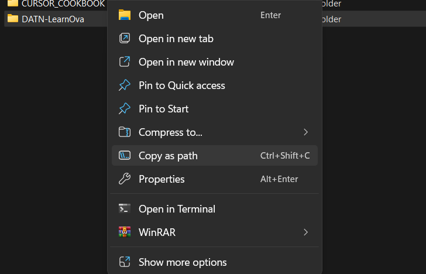
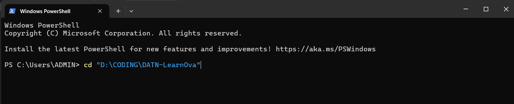
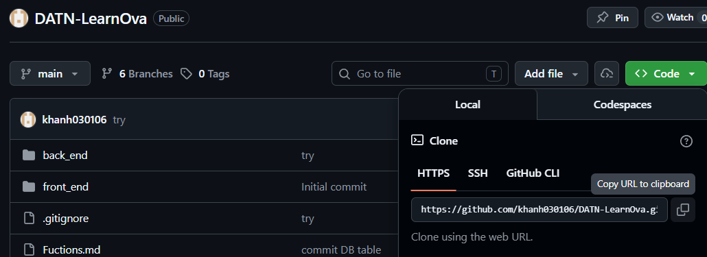
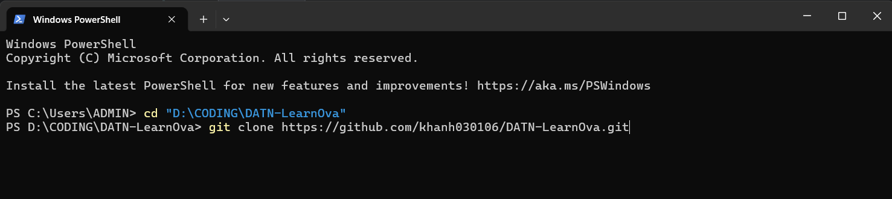
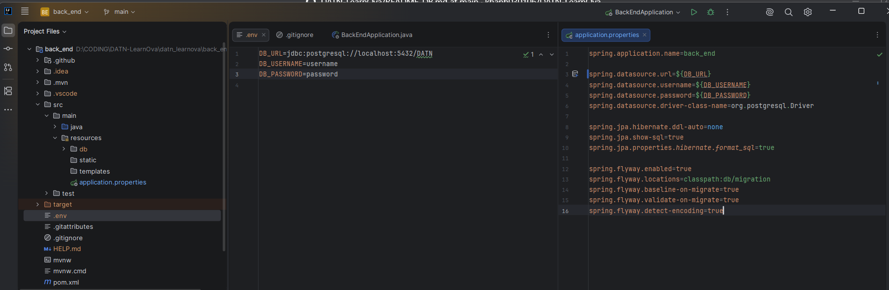
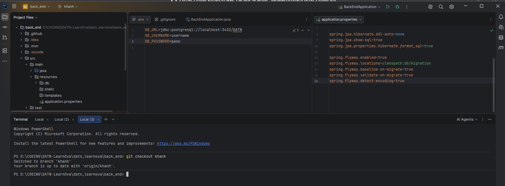
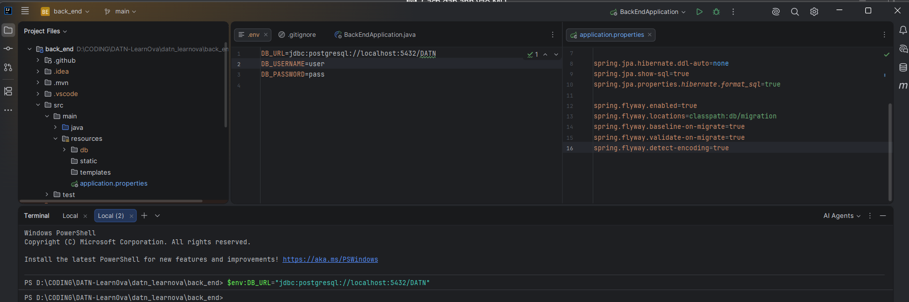
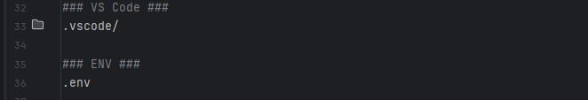

## Yêu cầu

- [PostgreSQL 18](https://www.postgresql.org/download/) đã được cài đặt
- [Java 25+](https://www.oracle.com/java/technologies/downloads/) đã được cài đặt

---

##  Lần đầu tiên (chỉ làm 1 lần)

### Bước 1 — Clone project

#### 1. Tạo folder ở chỗ muốn để DATN (đặt tên là DATN hay chi đó)
#### 2. Lấy Path của folder đó: Click chuột phải vào foler chọn Copy as path  

#### 3. cd tới folder nớ
- Mở **Terminal** gõ cd, cách rồi **Ctrl V** rồi Enter
- 
#### 4. Copy link repo từ github: chọn code -> HTTPS -> biểu tưởng coppy


#### 5. Mở Terminal nãy lên lại: git clone rồi ctrl V rồi Enter


### Bước 2 — Tạo database trống

Mở **pgAdmin** → click phải vào **Databases** → **Create** → **Database** → đặt tên `DATN` → nhấn **Save**.

### Bước 3 - Set Environment Variable
#### 1. Mở foler back_end, tạo file .env ở root project bằng cách click chuột phải vào back_end -> new file -> .env -> Enter -> Set url, username và password DB của mình (không được có dấu cách)
#### 2. Mở application.properties trong src/main/java/resources ra rồi thêm biến vào (tên phaỉ giống trong env). Phải đặt 3 biến như hình: DB_URL, DB_USERNAME, DB_PASSWORD

#### 3. Vẫn ở back_end, mở Terminal (góc dưới phải), git checkout + tên bản thân (ví dụ: git checkout khanh)

#### 4. Set biến (thay bằng URL, USER, PASSWORD của mình, coppy từ .env sang, tên biến cũng phải giống trong .env và application.properties), làm lần lượt 3 lệnh, làm từng lệnh 1, xong 1 lệnh thì Enter rồi làm lệnh tiếp theo
```powershell
$env:DB_URL="jdbc:postgresql://localhost:5432/DATN"  
$env:DB_USERNAME="thay bẳng username DB của bản thân"    
$env:DB_PASSWORD="thay bằng password của bản thân"
```

#### 5. gitignore
- Vẫn ở back_end, mở file .gitignore, thêm .env vào


### Bước 5
```powershell
[System.Environment]::SetEnvironmentVariable("DB_URL", "jdbc:postgresql://localhost:5432/DATN", "User")
[System.Environment]::SetEnvironmentVariable("DB_USERNAME", "postgres", "User")
[System.Environment]::SetEnvironmentVariable("DB_PASSWORD", "123", "User")
```

### Bước 4 — Chạy app lần đầu

```powershell
./mvnw spring-boot:run
```
