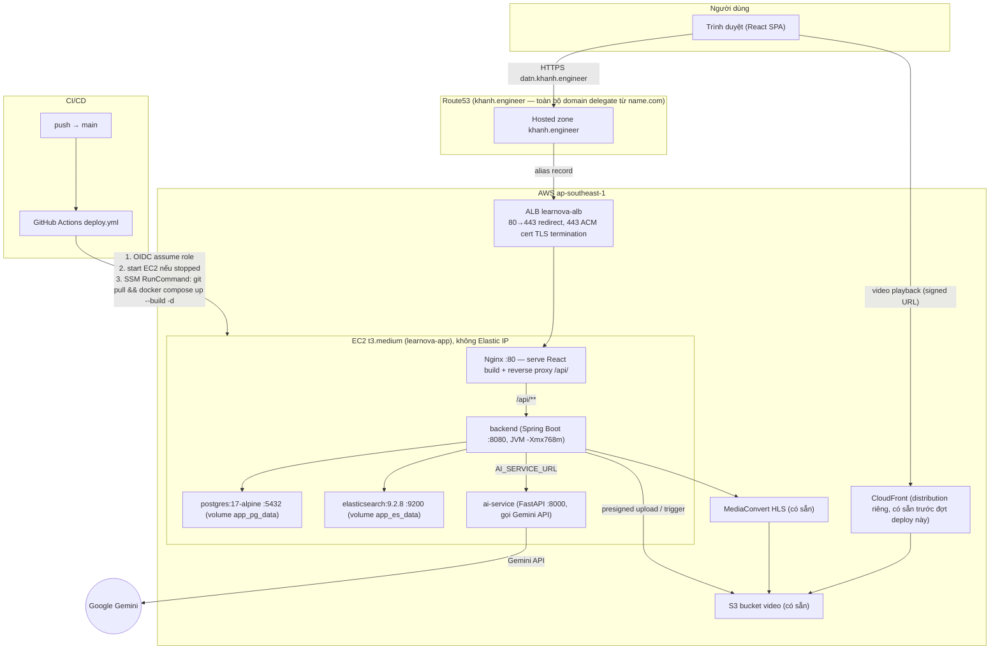

# Kiến trúc triển khai AWS — LearnOva

Tài liệu mô tả hạ tầng AWS thực tế đang chạy cho bản demo (không phải kế hoạch — đây là
trạng thái đã triển khai). IaC nằm ở [`infra/terraform/`](../infra/terraform/), app config ở
[`docker-compose.yml`](../docker-compose.yml) và [`.github/workflows/deploy.yml`](../.github/workflows/deploy.yml).

## Sơ đồ tổng quan

## Compute & networking

- **EC2**: 1 instance `t3.medium` (4GB RAM), Ubuntu 22.04, region `ap-southeast-1`, tag
  `Name=learnova-app`. Không gắn Elastic IP — ALB là điểm vào cố định duy nhất, EC2 không
  cần địa chỉ public ổn định.
- **Security groups**: EC2 chỉ nhận traffic từ security group của ALB trên port 80 (không
  mở public trực tiếp). SSH (22) tắt theo mặc định (`var.ssh_allowed_cidr = []`), quản lý
  máy hoàn toàn qua **SSM Session Manager** — không cần key pair, không mở port 22 ra internet.
- **ALB (`learnova-alb`)**: `internet-facing`, trải trên toàn bộ subnet của default VPC (3 AZ).
  Listener 80 redirect sang 443; listener 443 dùng cert ACM, forward vào target group
  `learnova-tg` (health check `/`, port 80).
- Instance được cài Docker + Docker Compose + AWS CLI qua `user_data` lúc boot đầu tiên
  (xem [`infra/terraform/user_data.sh.tftpl`](../infra/terraform/user_data.sh.tftpl)), tự
  `git clone` repo vào `/app`.
- `vm.max_map_count=262144` được set qua `user_data` (yêu cầu bắt buộc của Elasticsearch,
  mặc định Ubuntu chỉ 65530).

## Domain & TLS

- Domain `khanh.engineer` mua ở **name.com**, nhưng **toàn bộ DNS đã delegate sang Route53**
  (nameserver ở name.com trỏ vào 4 NS server của hosted zone Route53) — vì domain này chỉ
  dùng cho project, không có dịch vụ nào khác phụ thuộc.
- App chạy ở subdomain **`datn.khanh.engineer`**, alias record (A) trỏ thẳng vào ALB.
- Chứng chỉ ACM (`aws_acm_certificate` trong [`alb.tf`](../infra/terraform/alb.tf)) validate
  tự động qua DNS (Route53 tự thêm CNAME validation, không cần thao tác tay) — khác với lần
  setup đầu tiên khi domain còn ở name.com, phải tự tay thêm CNAME.
- Đổi subdomain (như đã làm 1 lần, từ `learnova.*` sang `datn.*`) chỉ cần đổi
  `var.domain_name` rồi `terraform apply` — cert mới + record mới tự tạo, không cần chạm
  vào name.com.

## Docker Compose — 5 service trên 1 instance

| Service | Image / build | Port nội bộ | `mem_limit` | Ghi chú |
|---|---|---|---|---|
| `postgres` | `postgres:17-alpine` | 5432 | 512m | Version phải khớp PG17+ vì migration Flyway dùng GUC `transaction_timeout` (chỉ có từ PG17) |
| `elasticsearch` | `elasticsearch:9.2.8` | 9200 | 1024m | `-Xms512m -Xmx512m`; 768m từng bị OOM-killed (exit 137), phải nâng lên 1024m |
| `ai-service` | build từ `ai_services/Dockerfile` | 8000 | 256m | FastAPI, gọi Gemini API, stateless |
| `backend` | build từ `back_end/Dockerfile` (multi-stage Maven→JRE, Java 25) | 8080 | 1024m | `JAVA_TOOL_OPTIONS=-Xmx768m`; `depends_on` postgres + elasticsearch (`service_healthy`) |
| `frontend` | build từ `front_end/Dockerfile` (multi-stage Node→Nginx) | 80 (expose ra host) | 64m | Nginx serve static build + reverse proxy `/api/` → `backend:8080`, SPA fallback |

Tổng RAM cấp phát theo `mem_limit`: **2880MB / 4096MB** của `t3.medium` — còn ~1.2GB cho OS +
Docker overhead + lúc build (`mvn`/`npm` chạy ngay trên instance khi `docker compose up
--build`). Nếu OOM tái diễn, phương án dự phòng là đổi `instance_type` sang `t3.large`
(8GB) trong `variables.tf`.

Biến môi trường quan trọng override trong `docker-compose.yml` (khác với `.env` dùng cho dev
local):
- `DB_URL` → trỏ vào `postgres` (hostname nội bộ Docker network) thay vì `localhost`
- `ES_URIS` → trỏ vào `elasticsearch`
- `AI_SERVICE_URL` → trỏ vào `ai-service`
- `CORS_ALLOWED_ORIGINS`, `FRONTEND_BASE_URL` → domain thật (`https://datn.khanh.engineer`) —
  bắt buộc, nếu không backend 403 mọi request vì Spring CORS filter chặn Origin không khớp
  trước khi tới bất kỳ rule `permitAll()` nào
- `COOKIE_SECURE=true` — an toàn vì toàn bộ traffic browser-facing đều qua HTTPS (ALB
  terminate TLS), Nginx forward đúng `X-Forwarded-Proto` gốc từ ALB

## CI/CD

Workflow duy nhất [`deploy.yml`](../.github/workflows/deploy.yml), đổi trigger theo giai đoạn:
- **Hiện tại** (đang code tính năng): `on: push: branches: [main]` — auto-deploy mỗi lần
  merge vào `main`.
- **1-2 ngày trước bảo vệ**: đổi sang `on: workflow_dispatch` (comment sẵn trong file) để
  khoá deploy tự động, tránh push lỡ tay phá bản demo đang chạy ổn.

Pipeline: GitHub Actions **assume role qua OIDC** (`learnova-github-actions-deploy`, không có
access key tĩnh nào lưu trong Secrets) → `aws ec2 start-instances` nếu đang stopped, đợi
`instance-running` + `instance-status-ok` → gửi lệnh qua **SSM Run Command**
(`cd /app && git pull && docker compose up --build -d`) — không mở port 22, không cần SSH key
trong CI.

## IAM

- `learnova-ec2-ssm-role` (gắn vào EC2 qua instance profile): `AmazonSSMManagedInstanceCore`
  + quyền đọc scoped `ssm:GetParameter` trên path `/learnova/deploy/*` + `kms:Decrypt`
  (dùng 1 lần để chuyển `.env` thật lên máy qua Parameter Store SecureString, đã xoá
  parameter sau khi dùng — xem phần Data bên dưới).
- `learnova-github-actions-deploy` (OIDC, trust policy giới hạn đúng
  `repo:khanh030106/DATN-LearnOva:ref:refs/heads/main`): `ec2:StartInstances` (scoped theo
  tag `Name=learnova-app`), `ec2:DescribeInstances`, `ec2:DescribeInstanceStatus`,
  `ssm:SendCommand`, `ssm:GetCommandInvocation`.

