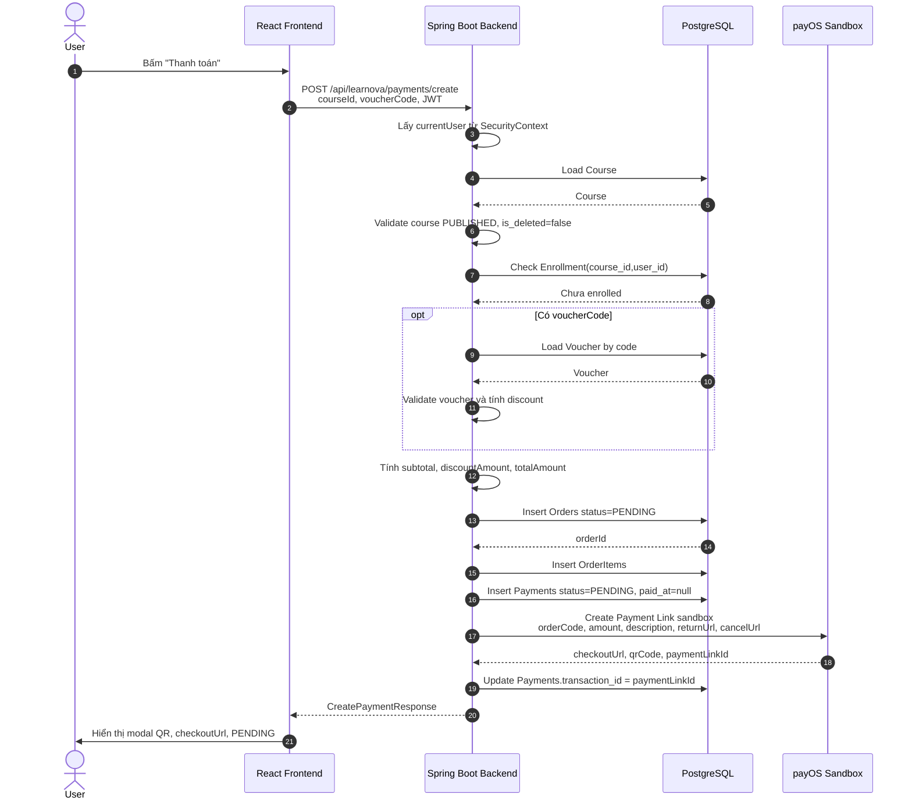
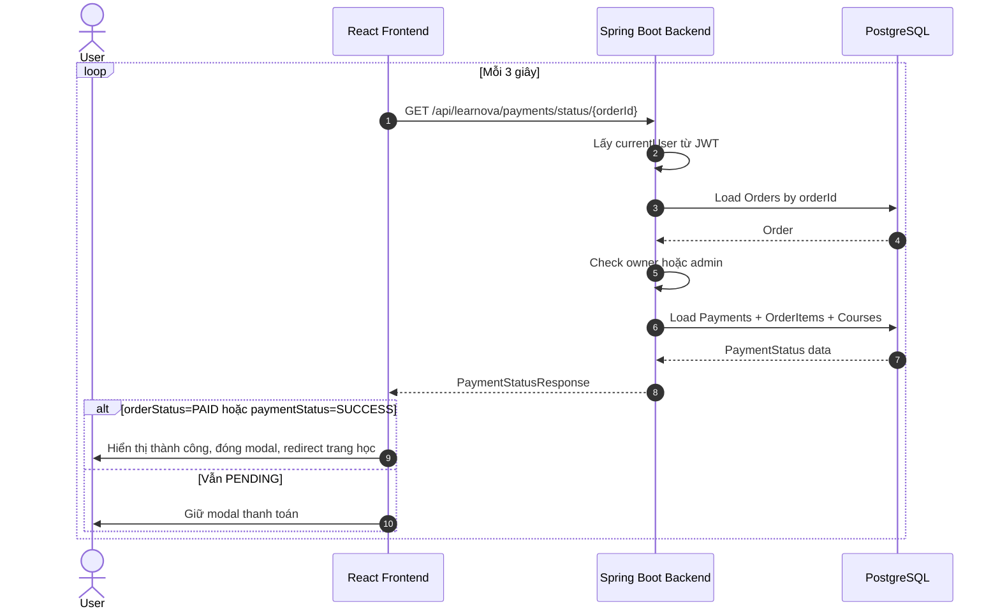
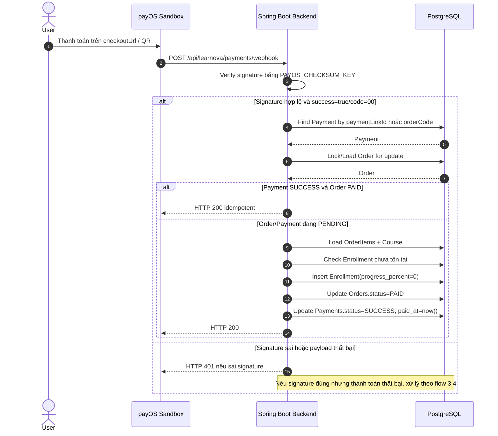
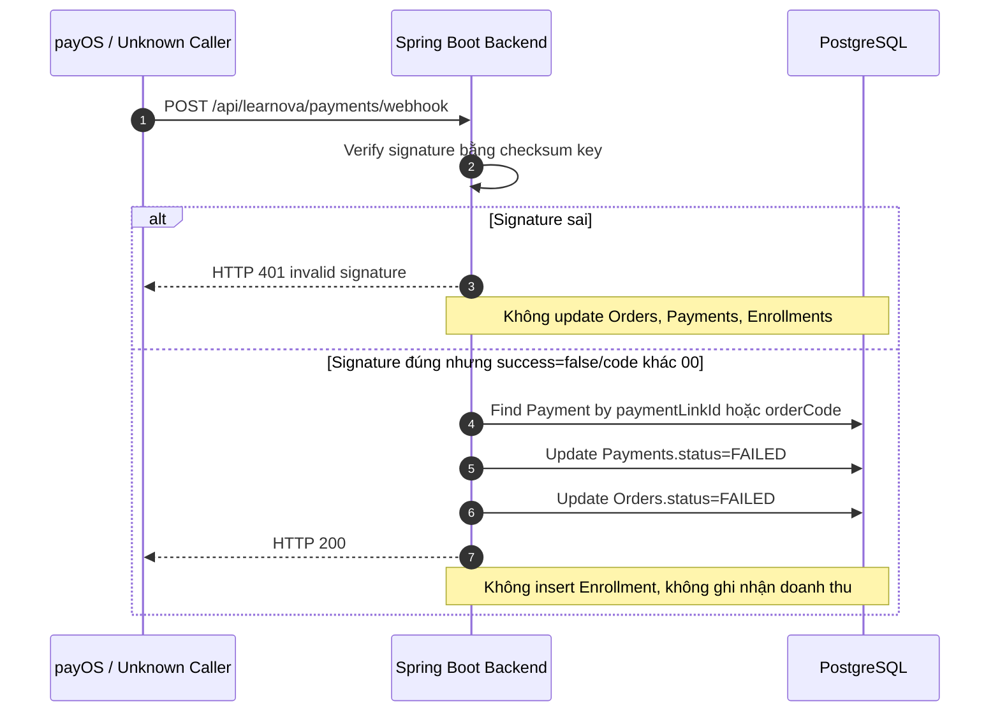

# Detail Design - Payment Feature với payOS Mode

## 1. Tổng Quan

Tài liệu này mô tả thiết kế chi tiết chức năng thanh toán khóa học LearnOva bằng payOS mode cho backend Spring Boot + PostgreSQL và frontend React.

Trạng thái hiện tại của source:

- Project đã có các entity/table cần dùng: `Courses`, `Orders`, `OrderItems`, `Payments`, `Enrollments`, `Vouchers`.
- `PaymentController`, `PaymentService`, `PayOSService`, `PaymentRepository` đang có nội dung nhưng bị comment do code lỗi/chưa build được.
- Không được tạo thêm bảng, không thêm cột, không sửa cấu trúc database.
- Chỉ webhook payOS hợp lệ mới được update `Orders.status = PAID`, `Payments.status = SUCCESS` và insert `Enrollments`.
- Frontend không có mock success, không có nút giả lập thanh toán.

Database hiện tại:

- Enum `payment_method` chỉ có: `MOMO`, `VNPAY`, `PAYPAL`.
- Chưa có enum `PAYOS`, vì vậy không sửa DB. Tạm thời lưu `Payments.payment_method = VNPAY` hoặc `PAYPAL`, nhưng response DTO trả `paymentMethod = "PAYOS"`.
- `Payments.transaction_id` dùng để lưu `paymentLinkId` của payOS.
- `Enrollments` dùng primary key gồm `(course_id, user_id)`.

## 2. Screen Definition

### 2.1 Màn Hình Chi Tiết Khóa Học / Nút Thanh Toán

Người dùng bấm nút `Thanh toán` trên màn hình chi tiết khóa học.

Frontend gọi:

```http
POST /api/learnova/payments/create
Authorization: Bearer <access_token>
Content-Type: application/json
```

Body:

```json
{
  "courseId": 1,
  "voucherCode": "SALE10"
}
```

Lưu ý:

- Frontend chỉ gửi `courseId`, `voucherCode`.
- Frontend tuyệt đối không gửi `userId`, `amount`, `subtotal`, `totalAmount`.
- Backend lấy user hiện tại từ JWT/Spring Security.
- Nếu DTO hiện tại còn field `courseIds`, flow thanh toán này vẫn chuẩn hóa theo `courseId` một khóa học. `courseIds` nếu giữ lại chỉ là mở rộng nội bộ, frontend không dùng cho flow này.

### 2.2 Modal Thanh Toán

Sau khi backend tạo payment link payOS thành công, frontend hiển thị modal thanh toán.

Dữ liệu hiển thị:

- Tên khóa học: `courseTitle`
- Giá gốc: `subtotal`
- Giảm giá: `discountAmount`
- Tổng tiền: `totalAmount`
- Mã QR: lấy từ `qrCode`
- Nút mở trang thanh toán: mở `checkoutUrl`
- Trạng thái ban đầu: `PENDING`

Frontend polling mỗi 3 giây:

```http
GET /api/learnova/payments/status/{orderId}
Authorization: Bearer <access_token>
```

Nếu response có `orderStatus = "PAID"` hoặc `paymentStatus = "SUCCESS"`:

- Hiện thông báo thanh toán thành công.
- Đóng modal.
- Redirect sang trang học / trang khóa học đã mua.

### 2.3 Trang Payment Success

`payos.return-url`:

```properties
payos.return-url=http://localhost:5173/payment/success
```

Trang này chỉ dùng để UX sau khi user quay về từ payOS. Trang này không được tự set thanh toán thành công. Frontend vẫn phải gọi status API để đọc trạng thái thật từ backend.

### 2.4 Trang Payment Cancel

`payos.cancel-url`:

```properties
payos.cancel-url=http://localhost:5173/payment/cancel
```

Trang này hiển thị thanh toán bị hủy / chưa hoàn tất. Không update DB thành công.

### 2.5 Admin Revenue Dashboard

Doanh thu chỉ tính các đơn thật sự thanh toán thành công:

- `Orders.status = PAID`
- `Payments.status = SUCCESS`

Công thức tính trong code theo mô hình marketplace:

- `platformRevenue = Orders.total_amount`
- `platformFee = totalAmount * 0.3`
- `instructorRevenue = totalAmount * 0.7`

Join bắt buộc:

```text
Orders -> OrderItems -> Courses -> Payments
```

Dashboard admin cần hiển thị:

- Doanh thu theo tháng.
- Doanh thu theo giảng viên.
- Doanh thu theo khóa học.
- Tổng số khóa bán được.
- Tổng số học viên mua.
- Hoa hồng website.
- Hoa hồng giảng viên.

Lưu ý quan trọng:

- Tiền không chuyển trực tiếp cho giảng viên qua payOS.
- Toàn bộ tiền học viên thanh toán đi vào tài khoản Merchant/Admin đã liên kết với payOS.
- Doanh thu giảng viên trong hệ thống chỉ là số liệu thống kê/đối soát.
- Cuối kỳ admin tự chuyển khoản hoa hồng cho giảng viên ngoài đời thực.
- Nếu database hiện tại chưa có bảng/cột payout thì chỉ hiển thị số liệu đối soát, không tự thêm bảng/cột để lưu trạng thái `PAID OUT`.

## 3. Sequence Diagram

Phần sequence diagram không nên chỉ dùng một sơ đồ gộp nếu đưa cho thành viên mới đọc. Một sơ đồ tổng có thể giúp hiểu end-to-end, nhưng khi implement cần tách từng flow để thấy rõ API nào do frontend gọi, API nào do payOS gọi, và bước nào được phép update database.

Trong tài liệu này dùng 4 sơ đồ:

- `3.1`: Luồng tạo payment link.
- `3.2`: Luồng frontend polling status.
- `3.3`: Luồng webhook thanh toán thành công.
- `3.4`: Luồng webhook sai signature / thanh toán thất bại.

### 3.1 Tạo Payment Link



### 3.2 Frontend Polling Payment Status



### 3.3 Webhook Thanh Toán Thành Công



### 3.4 Webhook Sai Signature / Thanh Toán Thất Bại



## 4. API Definition

### 4.1 Create Payment

Endpoint:

```http
POST /api/learnova/payments/create
```

Auth:

- Bắt buộc JWT.
- Backend lấy current user từ Spring Security.

Request:

```json
{
  "courseId": 1,
  "voucherCode": "SALE10"
}
```

Response:

```json
{
  "orderId": 123,
  "paymentId": 55,
  "courseId": 1,
  "courseTitle": "Spring Boot",
  "subtotal": 500000,
  "discountAmount": 50000,
  "totalAmount": 450000,
  "paymentMethod": "PAYOS",
  "paymentStatus": "PENDING",
  "orderStatus": "PENDING",
  "checkoutUrl": "...",
  "qrCode": "...",
  "paymentLinkId": "...",
  "expiresAt": "..."
}
```

Transaction:

- Method service phải có `@Transactional`.
- Nếu tạo `Orders`/`OrderItems`/`Payments` thành công nhưng gọi payOS lỗi thì transaction rollback, không để lại đơn rác.

### 4.2 Get Payment Status

Endpoint:

```http
GET /api/learnova/payments/status/{orderId}
```

Auth:

- Bắt buộc JWT.
- Chỉ owner của order hoặc admin được xem.

Response:

```json
{
  "orderId": 123,
  "paymentId": 55,
  "orderStatus": "PENDING",
  "paymentStatus": "PENDING",
  "paidAt": null,
  "courseId": 1,
  "courseTitle": "Spring Boot",
  "totalAmount": 450000
}
```

### 4.3 payOS Webhook

Endpoint:

```http
POST /api/learnova/payments/webhook
```

Auth:

- `permitAll` trong `SecurityConfig`.
- API này do payOS gọi, frontend không gọi.

Rule:

- Phải verify signature bằng `PAYOS_CHECKSUM_KEY`.
- Signature sai trả HTTP 401 và không update DB.
- Signature đúng và payload success mới xử lý paid.
- Webhook phải idempotent.

## 5. Field Definition

### 5.1 CreatePaymentRequest

| Field | Type | Required | Source | Description |
| --- | --- | --- | --- | --- |
| `courseId` | `Long` | Yes | Frontend | Khóa học cần mua. |
| `voucherCode` | `String` | No | Frontend | Mã voucher người dùng nhập. Có thể null/blank. |

Không nhận từ frontend:

| Field | Reason |
| --- | --- |
| `userId` | Backend lấy từ JWT, tránh user giả mạo. |
| `amount`, `subtotal`, `totalAmount` | Backend tính từ `Courses.base_price` và voucher, tránh sửa giá bên client. |

### 5.2 CreatePaymentResponse

| Field | Type | Description |
| --- | --- | --- |
| `orderId` | `Long` | ID của order vừa tạo. |
| `paymentId` | `Long` | ID của payment vừa tạo. |
| `courseId` | `Long` | ID khóa học chính. |
| `courseTitle` | `String` | Tên khóa học. |
| `subtotal` | `BigDecimal` | Giá gốc lấy từ `Courses.base_price`. |
| `discountAmount` | `BigDecimal` | Số tiền giảm sau khi validate voucher. |
| `totalAmount` | `BigDecimal` | `subtotal - discountAmount`. |
| `paymentMethod` | `String` | Luôn trả `"PAYOS"` cho frontend. |
| `paymentStatus` | `String` | Ban đầu là `PENDING`. |
| `orderStatus` | `String` | Ban đầu là `PENDING`. |
| `checkoutUrl` | `String` | Link thanh toán payOS. |
| `qrCode` | `String` | QR string/image data do payOS trả về, không lưu DB. |
| `paymentLinkId` | `String` | ID payment link của payOS, lưu vào `Payments.transaction_id`. |
| `expiresAt` | `OffsetDateTime` | Thời điểm hết hạn nếu payOS trả về. |

### 5.3 PaymentStatusResponse

| Field | Type | Description |
| --- | --- | --- |
| `orderId` | `Long` | ID order. |
| `paymentId` | `Long` | ID payment mới nhất của order. |
| `orderStatus` | `String` | `PENDING`, `PAID`, `FAILED`, `CANCELLED`. |
| `paymentStatus` | `String` | `PENDING`, `SUCCESS`, `FAILED`, `REFUNDED`. |
| `paidAt` | `OffsetDateTime` | Thời điểm thanh toán thành công, null khi pending. |
| `courseId` | `Long` | ID khóa học trong order item. |
| `courseTitle` | `String` | Tên khóa học trong order item. |
| `totalAmount` | `BigDecimal` | Tổng tiền order. |

### 5.4 Database Mapping

| Table | Columns used | Purpose |
| --- | --- | --- |
| `Courses` | `course_id`, `title`, `base_price`, `status`, `is_deleted` | Lấy thông tin khóa học và giá gốc. |
| `Orders` | `order_id`, `user_id`, `voucher_id`, `subtotal`, `discount_amount`, `total_amount`, `status`, `created_at`, `updated_at` | Đơn hàng tổng. |
| `OrderItems` | `order_item_id`, `order_id`, `course_id`, `original_price`, `price` | Chi tiết khóa học trong đơn. |
| `Payments` | `payment_id`, `order_id`, `amount`, `currency`, `payment_method`, `transaction_id`, `status`, `paid_at`, `updated_at` | Bản ghi thanh toán. |
| `Enrollments` | `course_id`, `user_id`, `order_id`, `enrolled_at`, `progress_percent` | Quyền học sau khi thanh toán thành công. |
| `Vouchers` | `voucher_id`, `code`, `discount_type`, `discount_value`, `minimum_order`, `maximum_discount_amount`, `usage_limit`, `used_count`, `start_date`, `end_date`, `is_active` | Validate và tính giảm giá. |

## 6. Validation

### 6.1 Course Validation

Khi create payment:

1. `courseId` bắt buộc khác null và lớn hơn 0.
2. Course phải tồn tại.
3. `Courses.status = PUBLISHED`.
4. `Courses.is_deleted = false`.
5. User hiện tại chưa có enrollment với course đó:

```text
exists Enrollments where course_id = courseId and user_id = currentUser.id
```

Nếu đã enrolled thì trả conflict/bad request tùy convention hiện tại của project.

### 6.2 Voucher Validation

Nếu `voucherCode` null/blank:

- `discountAmount = 0`.

Nếu có `voucherCode`:

1. Voucher phải tồn tại theo code, không phân biệt hoa thường.
2. `is_active = true`.
3. `now >= start_date`.
4. `now <= end_date`.
5. `used_count < usage_limit`.
6. `subtotal >= minimum_order`.
7. Tính discount:
   - `Percent`: `discount = subtotal * discount_value / 100`.
   - Nếu `maximum_discount_amount > 0`, discount không vượt quá maximum này.
   - `Fixed`: `discount = discount_value`.
8. `discount` không được lớn hơn `subtotal`.
9. Discount nhỏ nhất là 0.

Lưu ý `used_count`:

- Nếu database đã có trigger tăng `used_count` khi order paid thì backend không được tăng lại.
- Nếu không có trigger, cần thống nhất cách tăng `used_count` riêng, nhưng không được thêm cột/bảng.

### 6.3 Amount Validation

payOS amount là integer VND:

```text
totalAmount = subtotal - discountAmount
payOS amount = totalAmount as integer VND
```

Rule:

- `totalAmount` phải lớn hơn 0 khi gọi payOS.
- `totalAmount` phải convert được sang integer VND, không có phần lẻ.
- Không lấy amount từ frontend.

### 6.4 Status Authorization

`GET /status/{orderId}`:

- Owner: `Orders.user_id = currentUser.id`.
- Admin: có role `ROLE_ADMIN`.
- Người khác trả 403.

### 6.5 Webhook Validation

`POST /webhook`:

1. Verify signature bằng `PAYOS_CHECKSUM_KEY`.
2. Signature sai:
   - Return HTTP 401.
   - Không update bất kỳ bảng nào.
3. Signature đúng nhưng không success:
   - Tìm được order/payment thì update `Payments.status = FAILED`, `Orders.status = FAILED`.
   - Không insert `Enrollments`.
   - Không ghi nhận doanh thu.
   - Return HTTP 200 để payOS không retry vô ích.
4. Chỉ xử lý thành công khi:
   - `success = true` hoặc `code = "00"` theo payload payOS.
   - Tìm được payment qua `paymentLinkId` hoặc order qua `orderCode`.
   - Order đang `PENDING`.
   - Payment đang `PENDING`.

## 7. Processing Flow - Luồng Xử Lý Chi Tiết

Đây là phần quan trọng nhất khi bắt tay vào code. Có 3 flow chính:

| Flow | Ai gọi | Endpoint | Có update DB không? | Ghi chú |
| --- | --- | --- | --- | --- |
| Create payment | Frontend | `POST /api/learnova/payments/create` | Có, tạo `Orders`, `OrderItems`, `Payments` PENDING | Chưa tạo enrollment. |
| Check status | Frontend | `GET /api/learnova/payments/status/{orderId}` | Không bắt buộc update DB | Chỉ đọc trạng thái để UI polling. |
| Webhook | payOS | `POST /api/learnova/payments/webhook` | Có, nếu signature đúng và success | Chỉ flow này được set PAID/SUCCESS và insert Enrollment. |

Điểm cần nhớ:

- `return-url` chỉ là trang payOS redirect user về frontend, không phải bằng chứng đã thanh toán.
- `cancel-url` chỉ là trang user hủy/chưa hoàn tất thanh toán.
- Webhook mới là nguồn đáng tin cậy để backend xác nhận thanh toán.
- Polling status chỉ đọc kết quả backend đã lưu, không được tự fake success.

### 7.1 Create Payment Flow

Service method:

```java
@Transactional
CreatePaymentResponse createPayment(CreatePaymentRequest request)
```

Flow chi tiết:

1. Lấy `currentUser` từ `SecurityContextHolder`.
2. Validate `courseId`.
3. Load `Course` từ `CourseRepository`.
4. Check course:
   - Tồn tại.
   - `status = PUBLISHED`.
   - `isDeleted = false`.
5. Check user chưa enroll:
   - `EnrollmentRepository.existsByIdCourseIdAndIdUserId(courseId, userId) = false`.
6. Lấy giá gốc:
   - `subtotal = course.basePrice`.
7. Validate voucher nếu có.
8. Tính:
   - `discountAmount`.
   - `totalAmount = subtotal - discountAmount`.
9. Tạo `Orders`:
   - `user = currentUser`.
   - `voucher = voucher/null`.
   - `subtotal`.
   - `discountAmount`.
   - `totalAmount`.
   - `status = PENDING`.
   - `createdAt`, `updatedAt = now`.
10. Save and flush `Orders` để có `order_id`.
11. Tạo `OrderItems`:
   - `order = order`.
   - `course = course`.
   - `originalPrice = course.basePrice`.
   - `price = totalAmount` hoặc giá sau khi phân bổ discount.
12. Tạo `Payments`:
   - `order = order`.
   - `amount = totalAmount`.
   - `currency = VND`.
   - `paymentMethod = VNPAY` hoặc `PAYPAL` nếu enum chưa có `PAYOS`.
   - `status = PENDING`.
   - `paidAt = null`.
13. Gọi payOS Create Payment Link API bằng credentials:
   - `orderCode = order.id`.
   - `amount = totalAmount` integer VND.
   - `description = "ORDER" + order.id`.
   - `returnUrl`.
   - `cancelUrl`.
14. payOS trả:
   - `checkoutUrl`.
   - `qrCode`.
   - `paymentLinkId`.
   - `expiresAt` nếu có.
15. Update:
   - `Payments.transaction_id = paymentLinkId`.
16. Không lưu QR vào database.
17. Trả `CreatePaymentResponse` cho frontend.

Pseudo-code dễ hiểu:

```text
createPayment(request):
    user = getCurrentUserFromJWT()
    course = findCourse(request.courseId)
    validateCourseCanBuy(course)
    validateUserNotEnrolled(user, course)

    subtotal = course.basePrice
    voucher = findAndValidateVoucher(request.voucherCode) if voucherCode exists
    discountAmount = calculateDiscount(voucher, subtotal)
    totalAmount = subtotal - discountAmount
    validateIntegerVnd(totalAmount)

    order = insert Orders(PENDING)
    orderItem = insert OrderItems(order, course)
    payment = insert Payments(PENDING, method=VNPAY, paid_at=null)

    payosResult = callPayOSCreatePaymentLink(order.id, totalAmount)
    update payment.transaction_id = payosResult.paymentLinkId

    return response with paymentMethod="PAYOS", checkoutUrl, qrCode
```

DB state sau flow này:

| Table | Trạng thái |
| --- | --- |
| `Orders` | Có record mới, `status = PENDING`. |
| `OrderItems` | Có record mới trỏ tới order và course. |
| `Payments` | Có record mới, `status = PENDING`, `paid_at = null`, `transaction_id = paymentLinkId`. |
| `Enrollments` | Chưa insert. |

### 7.2 Status Flow

1. Lấy current user từ JWT.
2. Load `Orders` theo `orderId`.
3. Check owner/admin.
4. Load payment mới nhất theo order:
   - `PaymentRepository.findFirstByOrderIdOrderByIdDesc(orderId)`.
5. Load `OrderItems` kèm `Course`:
   - `OrderitemRepository.findByOrderIdWithCourse(orderId)`.
6. Trả `PaymentStatusResponse`.

Optional:

- Có thể gọi payOS Get Payment Info trong status API để sync trạng thái, nhưng không thay thế webhook.
- Nếu sync payOS thất bại, status API vẫn nên trả trạng thái DB hiện tại để polling không bị crash.

Pseudo-code:

```text
getPaymentStatus(orderId):
    user = getCurrentUserFromJWT()
    order = findOrder(orderId)
    if user is not owner and not admin:
        return 403

    payment = findLatestPaymentByOrder(orderId)
    orderItem = findOrderItemWithCourse(orderId)

    return PaymentStatusResponse
```

DB state sau flow này:

- Thông thường không thay đổi DB.
- Nếu có phần sync payOS status thì chỉ được dùng như bổ trợ. Không được bỏ verify webhook.

### 7.3 Webhook Success Flow

Service method:

```java
@Transactional
void handlePayOSWebhook(JsonNode body)
```

Flow chi tiết:

1. Controller nhận raw body từ payOS.
2. Verify signature:
   - Sai: return HTTP 401.
   - Đúng: tiếp tục.
3. Check webhook success:
   - Thành công khi `success = true` hoặc `code = "00"`.
   - Thất bại khi signature đúng nhưng `success = false` hoặc `code` khác `"00"`.
4. Lấy:
   - `paymentLinkId = body.data.paymentLinkId`.
   - `orderCode = body.data.orderCode`.
5. Tìm Payment:
   - Ưu tiên `Payments.transaction_id = paymentLinkId`.
   - Fallback tìm payment theo `orderCode/orderId`.
6. Lock/load Order để tránh double webhook:
   - Repository dùng `@Lock(PESSIMISTIC_WRITE)` khi cần.
7. Nếu payment đã `SUCCESS` và order đã `PAID`:
   - Return HTTP 200 ngay.
8. Nếu order/payment không còn `PENDING`:
   - Không được insert enrollment lần nữa.
   - Nên return HTTP 200 nếu đã xử lý trước đó, hoặc throw để rollback nếu trạng thái bất thường.
9. Load `OrderItems` kèm `Course`.
10. Với mỗi course trong order:
    - Check `Enrollment` chưa tồn tại theo `(course_id, user_id)`.
    - Insert Enrollment:
      - `course_id`.
      - `user_id`.
      - `order_id`.
      - `enrolled_at = now`.
      - `progress_percent = 0`.
11. Update `Orders.status = PAID`.
12. Update `Payments.status = SUCCESS`.
13. Update `Payments.paid_at = now`.
14. Commit transaction.

Rollback rule:

- Nếu lỗi ở bất kỳ bước nào trong transaction webhook, rollback toàn bộ. Không để order paid nhưng enrollment chưa tạo, hoặc payment success nhưng order chưa paid.

Pseudo-code:

```text
webhook(body):
    if verifySignature(body) == false:
        return 401

    if body.success != true and body.code != "00":
        markPaymentAndOrderFailedIfPending(body)
        return 200

    payment = findPaymentByPaymentLinkId(body.data.paymentLinkId)
              or findPaymentByOrderCode(body.data.orderCode)
    order = lockOrder(payment.orderId)

    if payment.status == SUCCESS and order.status == PAID:
        return 200

    if payment.status != PENDING or order.status != PENDING:
        rollback or ignore by business decision

    course = findCourseFromOrderItems(order)
    if enrollment does not exist:
        insert Enrollment(course_id, user_id, order_id, progress_percent=0)

    update order.status = PAID
    update payment.status = SUCCESS
    update payment.paid_at = now()
    return 200
```

DB state sau flow webhook thành công:

| Table | Trạng thái |
| --- | --- |
| `Orders` | `status = PAID`. |
| `Payments` | `status = SUCCESS`, `paid_at` có giá trị. |
| `Enrollments` | Có record `(course_id, user_id)` nếu trước đó chưa tồn tại. |

### 7.4 Cancel / Failed / Timeout Flow

Khi user hủy thanh toán hoặc đóng tab payOS:

1. payOS redirect user về `cancel-url` nếu user bấm hủy.
2. Frontend hiển thị trạng thái hủy/chưa thanh toán.
3. Backend không tự đổi `Orders.status` sang `PAID`.
4. `Orders` và `Payments` có thể vẫn là `PENDING`.
5. Nếu sau này cần job expire đơn cũ thì làm riêng, nhưng không thêm bảng/cột trong scope này.

Khi payOS gửi webhook hợp lệ báo thanh toán thất bại:

1. Verify signature bằng `PAYOS_CHECKSUM_KEY`.
2. Tìm `Payments` bằng `paymentLinkId` hoặc `orderCode`.
3. Nếu order/payment còn `PENDING`:
   - Update `Payments.status = FAILED`.
   - Update `Orders.status = FAILED`.
   - Không insert `Enrollments`.
   - Không ghi nhận doanh thu.
4. Return HTTP 200 cho payOS.

Không được làm:

- Không tạo nút "đã thanh toán".
- Không gọi webhook từ frontend.
- Không gọi API mock-success.
- Không set success chỉ vì user vào `/payment/success`.

## 8. Business Rule

### 8.1 Không Đổi Cấu Trúc Database

Bắt buộc:

- Không tạo bảng mới.
- Không thêm cột.
- Không sửa enum DB.
- Không sửa schema để thêm `PAYOS`.

Cách xử lý payment method:

```text
If DB enum supports PAYOS:
    save Payments.payment_method = PAYOS
Else:
    save Payments.payment_method = VNPAY or PAYPAL
Always:
    response.paymentMethod = "PAYOS"
```

Với database hiện tại, enum `payment_method` chỉ có `MOMO`, `VNPAY`, `PAYPAL`, nên lưu `VNPAY` là phù hợp.

### 8.2 Security Rule

- `/api/learnova/payments/create`: authenticated.
- `/api/learnova/payments/status/{orderId}`: authenticated, owner/admin only.
- `/api/learnova/payments/webhook`: `permitAll`, nhưng bắt buộc verify signature.
- Frontend không được gọi webhook.
- Không có endpoint mock-success.
- Không có nút fake thanh toán.

### 8.3 Payment State Rule

Trạng thái ban đầu khi create:

```text
Orders.status = PENDING
Payments.status = PENDING
Payments.paid_at = null
```

Chỉ webhook hợp lệ mới chuyển:

```text
Orders.status = PAID
Payments.status = SUCCESS
Payments.paid_at = now()
```

Không update thành công chỉ dựa vào:

- FE return URL.
- FE polling.
- Người dùng bấm nút.
- Manual request không có signature hợp lệ.

### 8.4 Enrollment Rule

Enrollment chỉ được tạo sau khi thanh toán thành công.

Điều kiện insert:

- Webhook signature đúng.
- payOS báo success.
- Order đang `PENDING`.
- Payment đang `PENDING`.
- Enrollment `(course_id, user_id)` chưa tồn tại.

Vì `Enrollments` có primary key `(course_id, user_id)`, webhook phải idempotent để không insert trùng khi payOS retry.

### 8.5 Voucher Rule

- Voucher chỉ áp dụng khi create order.
- Discount được ghi vào `Orders.discount_amount`.
- Nếu DB có trigger tăng `used_count` thì backend không tăng lại.
- Nếu order chưa thanh toán, không xem là doanh thu.

### 8.6 Revenue Rule

Dashboard doanh thu chỉ lấy đơn thành công:

```sql
WHERE o.status = 'PAID'
AND p.status = 'SUCCESS'
```

Tính tiền:

```text
platformRevenue = Orders.total_amount
platformFee = Orders.total_amount * 0.3
instructorRevenue = Orders.total_amount * 0.7
```

Sau mỗi giao dịch `SUCCESS`:

- Cộng doanh thu cho khóa học bằng `Orders.total_amount`.
- Cộng doanh thu cho giảng viên chỉ để thống kê bằng `Orders.total_amount * 0.7`.
- Cộng doanh thu toàn hệ thống bằng `Orders.total_amount`.
- Cộng hoa hồng website bằng `Orders.total_amount * 0.3`.
- Không chuyển tiền ngay cho giảng viên.

Ví dụ:

```text
Giá khóa học: 500000 VND
Tỷ lệ giảng viên: 70%
Tỷ lệ website: 30%

Doanh thu ghi nhận: 500000 VND
Doanh thu/hoa hồng giảng viên để đối soát: 350000 VND
Hoa hồng website: 150000 VND
```

Rule bắt buộc:

- Chỉ khi `Orders.status = PAID` và `Payments.status = SUCCESS` thì mới mở khóa học, insert `Enrollments`, ghi nhận doanh thu và tính doanh thu giảng viên.
- Nếu order/payment còn `PENDING`, `FAILED`, `CANCELLED`, `REFUNDED` thì không tính doanh thu.
- Không tạo bảng payout.
- Không thêm cột payout status.

### 8.7 Marketplace Money Flow / Payout Rule

Luồng tiền đúng của hệ thống marketplace:

```text
Student
    -> PayOS checkout/QR
    -> Merchant Account của Admin Website
    -> Website ghi nhận doanh thu
    -> Cuối kỳ admin đối soát
    -> Admin chuyển khoản hoa hồng cho giảng viên ngoài đời thực
```

Bắt buộc:

- Tiền không được chuyển trực tiếp từ học viên/payOS sang tài khoản giảng viên.
- Tài khoản nhận tiền trên payOS là tài khoản Merchant/Admin của website.
- Backend chỉ ghi nhận order/payment/enrollment và tính số liệu doanh thu.
- Doanh thu giảng viên là số tiền phải trả theo công thức chia sẻ, không phải giao dịch chuyển tiền thật.
- Admin payout cuối tháng là nghiệp vụ vận hành bên ngoài hệ thống nếu DB hiện tại chưa có bảng/cột payout.

Báo cáo cuối tháng cần tính từ các bảng hiện có:

- Tổng doanh thu toàn hệ thống.
- Tổng doanh thu từng giảng viên.
- Tổng doanh thu từng khóa học.
- Tổng số khóa bán được.
- Tổng số học viên mua.
- Hoa hồng website.
- Hoa hồng giảng viên.

Màn hình admin đối soát:

- Cho phép lọc theo tháng.
- Cho phép xem theo giảng viên.
- Cho phép xem theo khóa học.
- Có thể hiển thị nhãn nghiệp vụ `PAID OUT` / `Đã thanh toán hoa hồng` nếu trạng thái này chỉ là UI/manual note tạm thời.
- Không persist `PAID OUT` vào database nếu chưa có bảng/cột tương ứng.

## 9. Required Files

Controller:

- `back_end/src/main/java/com/example/back_end/controller/PaymentController.java`

Service:

- `back_end/src/main/java/com/example/back_end/service/PaymentService.java`
- `back_end/src/main/java/com/example/back_end/service/PayOSService.java`

Repository:

- `back_end/src/main/java/com/example/back_end/repository/PaymentRepository.java`
- `back_end/src/main/java/com/example/back_end/repository/OrderRepository.java`
- `back_end/src/main/java/com/example/back_end/repository/OrderitemRepository.java`
- `back_end/src/main/java/com/example/back_end/repository/EnrollmentRepository.java`
- `back_end/src/main/java/com/example/back_end/repository/CourseRepository.java`
- `back_end/src/main/java/com/example/back_end/repository/VoucherRepository.java`

DTO:

- `back_end/src/main/java/com/example/back_end/dto/resquest/CreatePaymentRequest.java`
- `back_end/src/main/java/com/example/back_end/dto/response/CreatePaymentResponse.java`
- `back_end/src/main/java/com/example/back_end/dto/response/PaymentStatusResponse.java`

Config:

- `back_end/src/main/resources/application.properties`
- `back_end/src/main/java/com/example/back_end/config/SecurityConfig.java`

## 10. Setup / Configuration Guide

Phần này hướng dẫn cài đặt từ đầu để thành viên mới có thể chạy được flow thanh toán payOS.

### 10.1 Điều Kiện Trước Khi Setup

Cần có:

- PostgreSQL đang chạy và đã có schema hiện tại của project.
- Backend Spring Boot chạy được.
- Frontend React chạy ở `http://localhost:5173`.
- Tài khoản payOS.
- Tiền thật
- Bộ Key production của payOS:
  - `PAYOS_CLIENT_ID`
  - `PAYOS_API_KEY`
  - `PAYOS_CHECKSUM_KEY`

### 10.2 Lấy payOS Credentials

Thành viên phụ trách payment đăng nhập dashboard payOS và lấy credentials ở môi trường test/sandbox:

```text
Client ID      -> PAYOS_CLIENT_ID
API Key        -> PAYOS_API_KEY
Checksum Key   -> PAYOS_CHECKSUM_KEY
```

Sau khi lấy key:

- Không commit key thật lên Git.
- Không ghi trực tiếp key vào source.
- Chỉ đặt key trong `.env`, biến môi trường local, hoặc config secret của môi trường deploy.

### 10.3 Cấu Hình `.env`

File `.env` ở root project cần có các biến sau. Giá trị minh họa bên dưới chỉ là placeholder:

```env
PAYOS_CLIENT_ID=your_sandbox_client_id
PAYOS_API_KEY=your_sandbox_api_key
PAYOS_CHECKSUM_KEY=your_sandbox_checksum_key
```

Ngoài payOS, backend vẫn cần các biến có sẵn của project như:

```env
DB_URL=jdbc:postgresql://localhost:5432/learnova
DB_USERNAME=postgres
DB_PASSWORD=your_password
JWT_SECRET=your_jwt_secret
FRONTEND_BASE_URL=http://localhost:5173
```

Tên database, username, password tùy máy local của từng thành viên.

### 10.4 Cấu Hình `application.properties`

File:

```text
back_end/src/main/resources/application.properties
```

Cần mở comment hoặc thêm cấu hình:

```properties
payos.client-id=${PAYOS_CLIENT_ID}
payos.api-key=${PAYOS_API_KEY}
payos.checksum-key=${PAYOS_CHECKSUM_KEY}
payos.return-url=http://localhost:5173/payment/success
payos.cancel-url=http://localhost:5173/payment/cancel
```

Hiện tại source đang có dạng bị comment:

```properties
#payos.client-id=${PAYOS_CLIENT_ID}
#payos.api-key=${PAYOS_API_KEY}
#payos.checksum-key=${PAYOS_CHECKSUM_KEY}
#payos.return-url=${PAYOS_RETURN_URL:http://localhost:5173/payment/success}
#payos.cancel-url=${PAYOS_CANCEL_URL:http://localhost:5173/payment/cancel}
```

Khi implement payment thì bỏ dấu `#` và dùng đúng URL local:

```properties
payos.return-url=http://localhost:5173/payment/success
payos.cancel-url=http://localhost:5173/payment/cancel
```

### 10.5 Cấu Hình Security

File:

```text
back_end/src/main/java/com/example/back_end/config/SecurityConfig.java
```

Webhook phải `permitAll` vì payOS gọi vào backend, không có JWT của user:

```java
.requestMatchers(HttpMethod.POST, "/api/learnova/payments/webhook").permitAll()
```

Nhưng `permitAll` không có nghĩa là ai cũng update được DB. Backend vẫn phải verify signature bằng `PAYOS_CHECKSUM_KEY`. Nếu signature sai thì return HTTP 401 và không update DB.

Các API còn lại:

```text
POST /api/learnova/payments/create        -> authenticated
GET  /api/learnova/payments/status/{id}   -> authenticated
POST /api/learnova/payments/webhook       -> permitAll + verify signature
```

### 10.6 Cấu Hình payOS Webhook URL

Khi chạy local, payOS cần gọi được webhook từ internet. Nếu backend chỉ chạy ở `localhost`, payOS bên ngoài sẽ không gọi được trực tiếp.

Có 2 cách setup local:

1. Dùng tunnel như ngrok/cloudflared để expose backend local.
2. Deploy backend lên môi trường dev public tạm thời.

Ví dụ nếu backend local chạy port `8080` và tunnel trả URL:

```text
https://abc-example.ngrok-free.app
```

Webhook URL cấu hình trong payOS sẽ là:

```text
https://abc-example.ngrok-free.app/api/learnova/payments/webhook
```

Lưu ý:

- Frontend không gọi URL webhook này.
- payOS gọi webhook này sau khi trạng thái thanh toán thay đổi.
- Nếu webhook không gọi được thì order/payment có thể cứ `PENDING`.

### 10.7 Chạy Backend

Điều kiện:

- PostgreSQL đã chạy.
- `DB_URL`, `DB_USERNAME`, `DB_PASSWORD`, `JWT_SECRET`, payOS env đã có.
- Flyway migration không lỗi.

Chạy backend theo cách project đang dùng. Ví dụ thường gặp:

```powershell
cd back_end
./mvnw spring-boot:run
```

Hoặc nếu không dùng wrapper:

```powershell
cd back_end
mvn spring-boot:run
```

Backend mặc định thường chạy ở:

```text
http://localhost:8080
```

### 10.8 Chạy Frontend

Frontend React cần chạy ở port khớp với return/cancel URL:

```powershell
cd front_end
npm install
npm run dev
```

URL mong đợi:

```text
http://localhost:5173
```

Frontend cần có route:

```text
/payment/success
/payment/cancel
```

Hai route này chỉ hiển thị UI và gọi status API nếu cần. Không được tự set thanh toán thành công.

### 10.9 Test Flow Từ Đầu Đến Cuối

Bước 1: Đăng nhập frontend để có JWT.

Bước 2: Vào chi tiết khóa học đã `PUBLISHED`.

Bước 3: Bấm `Thanh toán`.

Bước 4: Frontend gọi:

```http
POST /api/learnova/payments/create
```

Body:

```json
{
  "courseId": 1,
  "voucherCode": "SALE10"
}
```

Bước 5: Backend trả `checkoutUrl`, `qrCode`, `orderId`, `paymentId`.

Bước 6: Kiểm tra DB:

```sql
SELECT * FROM Orders ORDER BY order_id DESC;
SELECT * FROM OrderItems ORDER BY order_item_id DESC;
SELECT * FROM Payments ORDER BY payment_id DESC;
```

Bước 7: Thanh toán trên payOS bằng QR hoặc checkout URL.

Bước 8: payOS gọi webhook:

```http
POST /api/learnova/payments/webhook
```

Bước 9: Kiểm tra DB sau webhook:

```sql
SELECT * FROM Orders ORDER BY order_id DESC;
SELECT * FROM Payments ORDER BY payment_id DESC;
SELECT * FROM Enrollments ORDER BY enrolled_at DESC;
```

Kết quả đúng:

- `Orders.status = PAID`.
- `Payments.status = SUCCESS`.
- `Payments.paid_at` khác null.
- `Enrollments` có record mới.

Bước 10: Frontend polling status thấy success và redirect sang trang học.

### 10.10 Checklist Khi Setup Bị Lỗi

Nếu create payment lỗi:

- Check `PAYOS_CLIENT_ID`, `PAYOS_API_KEY`, `PAYOS_CHECKSUM_KEY`.
- Check `application.properties` đã bỏ comment payOS config chưa.
- Check `totalAmount` có phải integer VND và lớn hơn 0 không.
- Check course có `PUBLISHED` và `is_deleted = false` không.
- Check user đã enroll khóa đó chưa.

Nếu webhook không chạy:

- Check webhook URL trên dashboard payOS có trỏ đúng backend public/tunnel không.
- Check `SecurityConfig` đã `permitAll` webhook chưa.
- Check signature verify có dùng đúng `PAYOS_CHECKSUM_KEY` sandbox không.
- Check backend log có nhận request từ payOS không.

Nếu webhook chạy nhưng không insert enrollment:

- Check order/payment có đang `PENDING` trước webhook không.
- Check `OrderItems` có record theo `order_id` không.
- Check `Enrollments` đã tồn tại `(course_id, user_id)` chưa.
- Check transaction có rollback do lỗi entity/mapping không.

Nếu frontend không chuyển success:

- Check polling có gọi đúng `GET /api/learnova/payments/status/{orderId}` không.
- Check response đã có `orderStatus = PAID` hoặc `paymentStatus = SUCCESS` chưa.
- Check frontend không dùng state local để fake success.

## 11. Implementation Notes Based On Current Source

### 11.1 Current Commented Payment Code

Trong source hiện tại, các file payment có logic gần đúng nhưng đang bị comment:

- `PaymentController.java`
- `PaymentService.java`
- `PayOSService.java`
- `PaymentRepository.java`

Khi fix/uncomment cần check:

- Package DTO đang là `dto.resquest` trong project, không phải `dto.request`.
- Java version có hỗ trợ `List.getFirst()` hay không. Nếu project không dùng Java 21, đổi sang `list.get(0)`.
- `Course` entity map column `thumbnail_key`, trong `database.sql` đang có `thumbnail_url`; nếu build/run lỗi entity mapping thì cần xử lý riêng, không nằm trong scope payment DB change.
- `application.properties` hiện đang comment payOS config, cần mở lại đúng giá trị sandbox.

### 11.2 Repository Methods Needed

`PaymentRepository`:

```java
Optional<Payment> findFirstByOrderIdOrderByIdDesc(Long orderId);
Optional<Payment> findByTransactionId(String transactionId);
```

`OrderRepository`:

```java
@Lock(LockModeType.PESSIMISTIC_WRITE)
@Query("SELECT o FROM Order o JOIN FETCH o.user WHERE o.id = :orderId")
Optional<Order> findByIdForPaymentUpdate(@Param("orderId") Long orderId);
```

`OrderitemRepository`:

```java
@Query("SELECT oi FROM Orderitem oi JOIN FETCH oi.course WHERE oi.order.id = :orderId ORDER BY oi.id ASC")
List<Orderitem> findByOrderIdWithCourse(@Param("orderId") Long orderId);
```

`EnrollmentRepository`:

```java
boolean existsByIdCourseIdAndIdUserId(Long courseId, Long userId);
```

`VoucherRepository`:

```java
Optional<Voucher> findByCodeIgnoreCase(String code);
```

## 12. Test SQL

### 12.1 Sau khi create payment

```sql
SELECT * FROM Orders ORDER BY order_id DESC;
SELECT * FROM OrderItems ORDER BY order_item_id DESC;
SELECT * FROM Payments ORDER BY payment_id DESC;
```

Kết quả mong đợi:

- Có order mới `PENDING`.
- Có order item gắn với course.
- Có payment mới `PENDING`.
- `Payments.transaction_id` có `paymentLinkId` sau khi payOS trả thành công.
- `Payments.paid_at` vẫn null.

### 12.2 Sau khi thanh toán thành công

```sql
SELECT * FROM Orders ORDER BY order_id DESC;
SELECT * FROM Payments ORDER BY payment_id DESC;
SELECT * FROM Enrollments ORDER BY enrolled_at DESC;
```

Kết quả mong đợi:

- Order đổi sang `PAID`.
- Payment đổi sang `SUCCESS`.
- `Payments.paid_at` có giá trị.
- `Enrollments` có record `(course_id, user_id)` từ order.

### 12.3 SQL doanh thu

```sql
SELECT
o.order_id,
o.user_id,
c.course_id,
c.title,
c.instructor_id,
o.subtotal,
o.discount_amount,
o.total_amount,
p.payment_method,
p.status AS payment_status,
o.status AS order_status,
p.paid_at
FROM Orders o
JOIN OrderItems oi ON oi.order_id = o.order_id
JOIN Courses c ON c.course_id = oi.course_id
JOIN Payments p ON p.order_id = o.order_id
WHERE o.status = 'PAID'
AND p.status = 'SUCCESS'
ORDER BY o.order_id DESC;
```

### 12.4 SQL báo cáo marketplace cuối tháng

Tất cả query báo cáo chỉ lấy giao dịch đã thanh toán thật:

```sql
WHERE o.status = 'PAID'
AND p.status = 'SUCCESS'
```

Tổng doanh thu toàn hệ thống theo tháng:

```sql
SELECT
DATE_TRUNC('month', p.paid_at) AS revenue_month,
SUM(o.total_amount) AS total_revenue,
SUM(o.total_amount * 0.30) AS website_commission,
SUM(o.total_amount * 0.70) AS instructor_commission,
COUNT(DISTINCT o.order_id) AS total_orders,
COUNT(DISTINCT o.user_id) AS total_students,
COUNT(oi.order_item_id) AS total_courses_sold
FROM Orders o
JOIN OrderItems oi ON oi.order_id = o.order_id
JOIN Payments p ON p.order_id = o.order_id
WHERE o.status = 'PAID'
AND p.status = 'SUCCESS'
GROUP BY DATE_TRUNC('month', p.paid_at)
ORDER BY revenue_month DESC;
```

Doanh thu theo giảng viên:

```sql
SELECT
c.instructor_id,
SUM(o.total_amount) AS gross_revenue,
SUM(o.total_amount * 0.70) AS instructor_commission,
SUM(o.total_amount * 0.30) AS website_commission,
COUNT(oi.order_item_id) AS courses_sold,
COUNT(DISTINCT o.user_id) AS students_bought
FROM Orders o
JOIN OrderItems oi ON oi.order_id = o.order_id
JOIN Courses c ON c.course_id = oi.course_id
JOIN Payments p ON p.order_id = o.order_id
WHERE o.status = 'PAID'
AND p.status = 'SUCCESS'
GROUP BY c.instructor_id
ORDER BY gross_revenue DESC;
```

Doanh thu theo khóa học:

```sql
SELECT
c.course_id,
c.title,
c.instructor_id,
SUM(o.total_amount) AS course_revenue,
SUM(o.total_amount * 0.70) AS instructor_commission,
SUM(o.total_amount * 0.30) AS website_commission,
COUNT(oi.order_item_id) AS sold_count,
COUNT(DISTINCT o.user_id) AS students_bought
FROM Orders o
JOIN OrderItems oi ON oi.order_id = o.order_id
JOIN Courses c ON c.course_id = oi.course_id
JOIN Payments p ON p.order_id = o.order_id
WHERE o.status = 'PAID'
AND p.status = 'SUCCESS'
GROUP BY c.course_id, c.title, c.instructor_id
ORDER BY course_revenue DESC;
```

Các số `instructor_commission` trong báo cáo là số tiền admin cần đối soát và chuyển khoản thủ công cho giảng viên. Không có query nào tự tạo payout hoặc đánh dấu payout trong database.

## 13. Error Handling Recommendation

| Case | Suggested HTTP | Message |
| --- | --- | --- |
| Missing/invalid JWT | 401 | `Authentication required` |
| Course not found | 404 | `Course not found` |
| Course not published/deleted | 400 | `Course is not available for purchase` |
| User already enrolled | 409 | `You are already enrolled in this course` |
| Voucher not found | 400 | `Voucher not found` |
| Voucher inactive/expired | 400 | `Voucher is not active` |
| Voucher usage limit reached | 400 | `Voucher usage limit reached` |
| Amount not integer VND or <= 0 | 400 | `Total amount must be an integer VND greater than 0` |
| Status viewed by non-owner | 403 | `You cannot view this order` |
| Webhook signature invalid | 401 | `invalid signature` |
| payOS create link failed | 502 or 500 | `payOS create payment link failed` |

## 14. Developer Checklist

- Mở comment/fix `PaymentController`.
- Mở comment/fix `PaymentService`.
- Mở comment/fix `PayOSService`.
- Mở comment/fix `PaymentRepository`.
- Đảm bảo `PaymentService.createPayment` có `@Transactional`.
- Đảm bảo webhook handle trong transaction và idempotent.
- Đảm bảo `SecurityConfig` permitAll webhook.
- Mở payOS config trong `application.properties`.
- Set env vars: `PAYOS_CLIENT_ID`, `PAYOS_API_KEY`, `PAYOS_CHECKSUM_KEY`.
- FE chỉ gửi `courseId`, `voucherCode`.
- FE polling status mỗi 3 giây.
- FE không fake success.
- Revenue chỉ tính order/payment thành công.
- Webhook success mới set `Orders.status = PAID`, `Payments.status = SUCCESS` và insert `Enrollments`.
- Webhook failure hợp lệ set `Orders.status = FAILED`, `Payments.status = FAILED` và không insert `Enrollments`.
- Tiền payOS phải về Merchant/Admin account, không về trực tiếp giảng viên.
- Revenue report chia thống kê 70% giảng viên, 30% website.
- Không thêm bảng/cột payout; admin đối soát và chuyển hoa hồng thủ công ngoài hệ thống.
