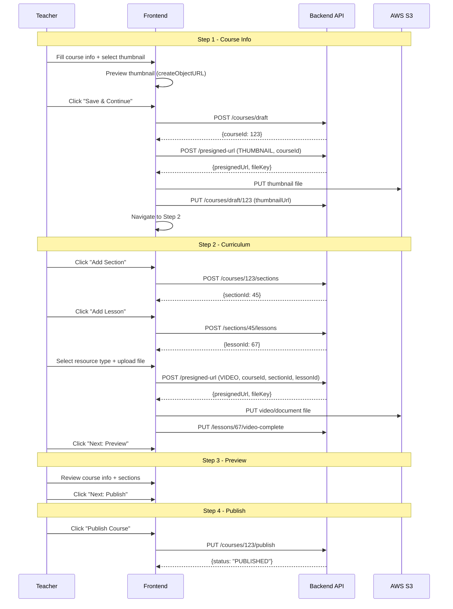

# Hoàn thiện Flow Tạo Khóa Học (Course Creation)

## Đánh giá Flow Hiện Tại

### ✅ Những điểm ĐÃ TỐT (Best Practice)

1. **Kiến trúc 2 lớp component** — Đã có bộ component mới tổ chức theo subdirectory (`course-info/`, `curriculum/`, `preview/`, `publish/`, `stepper/`) rất clean
2. **Custom hook `useCourseCreationForm`** — Tách logic ra khỏi UI, gọn gàng, có `saveCourseDraft()` trả `courseId`
3. **Custom hook `useCourseMediaUpload`** — Tách upload logic riêng, tạo preview URL bằng `URL.createObjectURL()`
4. **Presigned URL pattern** — Upload S3 đúng best practice: BE tạo presigned URL → FE upload trực tiếp lên S3
5. **Thumbnail preview** — `CourseThumbnailUploader` đã hiển thị `` preview khi có URL
6. **Validation** — Có file validation riêng với `getCourseCreationIssues()`
7. **Database schema** — Chặt chẽ với constraints, triggers, enum types

### ⚠️ Những điểm CẦN SỬA

| # | Vấn đề | Mức độ |
|---|--------|--------|
| 1 | **`CourseCreationPage.jsx` vẫn dùng DỮ LIỆU CỨNG** — `initialCourse` có title, price, sections hardcoded, import `course-1.jpg` | 🔴 Critical |
| 2 | **Trang chính vẫn import component CŨ** (flat files) thay vì dùng bộ mới trong subdirectories | 🔴 Critical |
| 3 | **Chưa có BE API cho Section/Lesson** — `useCourseCreationForm` import từ `api/teacher/courseCreation/courseCreationApi.js` nhưng file này CHƯA TỒN TẠI | 🔴 Critical |
| 4 | **Chưa có FE API module** — `api/teacher/courseCreation/courseCreationApi.js` và `courseMediaApi.js` chưa được tạo | 🔴 Critical |
| 5 | **BE không có endpoint tạo Section/Lesson** — `CourseController.java` chỉ có CRUD course + presigned URL | 🔴 Critical |
| 6 | **Publish chỉ set state local** — `publishCourse()` chỉ `setCourse({status: "PUBLISHED"})`, không gọi API | 🟡 Major |
| 7 | **DB constraints cứng trên Lesson** — `video_url NOT NULL`, `duration_seconds NOT NULL CHECK > 0` khiến không tạo được lesson draft | 🟡 Major |
| 8 | **LessonRow chưa có resource type selector** — Chỉ upload video, thiếu select loại (Video/Document/Resource) | 🟡 Major |
| 9 | **`CourseApi.js` (old) thừa** — Bị duplicate với bộ API mới | 🟡 Minor |

## Open Questions

> [!IMPORTANT]
> **Database schema change cần thiết?**
> Bảng `Lessons` hiện require `video_url NOT NULL` và `duration_seconds NOT NULL CHECK > 0`. Khi tạo lesson draft, chưa có video nên cần ALTER bảng để cho phép `NULL`. Bạn có đồng ý sửa schema không?

> [!IMPORTANT]
> **Backend API** — Hiện tại BE không có endpoint cho Section/Lesson. Mình sẽ cần tạo:
> - `POST /api/learnova/courses/{courseId}/sections` — Tạo section
> - `PUT /api/learnova/sections/{sectionId}` — Cập nhật section title
> - `DELETE /api/learnova/sections/{sectionId}` — Xóa section
> - `POST /api/learnova/sections/{sectionId}/lessons` — Tạo lesson
> - `PUT /api/learnova/lessons/{lessonId}` — Cập nhật lesson title
> - `DELETE /api/learnova/lessons/{lessonId}` — Xóa lesson
> - `PUT /api/learnova/lessons/{lessonId}/video-complete` — Xác nhận upload video xong
> - `PUT /api/learnova/courses/{courseId}/publish` — Publish course
> 
> Bạn có muốn tạo luôn cả BE hay chỉ làm FE trước?

## Proposed Changes

### Frontend — Clean Up & Wire to Real API

---

#### [MODIFY] [CourseCreationPage.jsx](file:///d:/CODING/DATN/DATN-LearnOva/front_end/src/page/teacher/courses/create/CourseCreationPage.jsx)
- **Xóa toàn bộ `initialCourse` và `initialSections` hardcoded**
- Import và sử dụng `useCourseCreationForm` hook (đã có)
- Import và sử dụng `useCourseMediaUpload` hook (đã có)
- Switch sang import component mới từ subdirectories (`course-info/`, `curriculum/`, `preview/`, `publish/`, `stepper/`)
- Xóa import `course-1.jpg`
- `onNext` ở step 1 sẽ gọi `saveCourseDraft()` → nhận `courseId` → upload thumbnail lên S3
- `onNext` ở step 3 (Preview → Publish) giữ nguyên chuyển step
- `onPublish` gọi API publish course thực sự

---

#### [NEW] [courseCreationApi.js](file:///d:/CODING/DATN/DATN-LearnOva/front_end/src/api/teacher/courseCreation/courseCreationApi.js)
FE API module cho CRUD course/section/lesson:
- `createDraftCourse(payload)` → `POST /courses/draft`
- `createSection(courseId, payload)` → `POST /courses/{courseId}/sections`
- `updateSectionTitle(sectionId, title)` → `PUT /sections/{sectionId}`
- `deleteSection(sectionId)` → `DELETE /sections/{sectionId}`
- `createLesson(sectionId, payload)` → `POST /sections/{sectionId}/lessons`
- `updateLessonTitle(lessonId, title)` → `PUT /lessons/{lessonId}`
- `deleteLesson(lessonId)` → `DELETE /lessons/{lessonId}`
- `publishCourse(courseId)` → `PUT /courses/{courseId}/publish`

#### [NEW] [courseMediaApi.js](file:///d:/CODING/DATN/DATN-LearnOva/front_end/src/api/teacher/courseCreation/courseMediaApi.js)
FE API module cho upload:
- `createThumbnailUploadUrl(courseId, file)` → gọi presigned URL với `fileType: THUMBNAIL`
- `createLessonVideoUploadUrl(lessonId, file)` → gọi presigned URL với `fileType: VIDEO`
- `createLessonResourceUploadUrl(lessonId, file, resourceType)` → gọi presigned URL với `fileType: DOCUMENT`
- `uploadFileToS3(url, file)` → PUT file trực tiếp lên S3
- `completeLessonVideoUpload(lessonId)` → xác nhận video upload hoàn tất

---

#### [MODIFY] [useCourseCreationForm.js](file:///d:/CODING/DATN/DATN-LearnOva/front_end/src/page/teacher/courses/create/hooks/useCourseCreationForm.js)
- Thêm `publishCourse` gọi API publish thực sự thay vì chỉ set state
- Thêm `deleteSection` gọi API xoá
- Thêm `deleteLesson` gọi API xoá
- Thêm loading states

#### [MODIFY] [useCourseMediaUpload.js](file:///d:/CODING/DATN/DATN-LearnOva/front_end/src/page/teacher/courses/create/hooks/useCourseMediaUpload.js)
- Thêm `handleThumbnailUpload(courseId, file)` — thực sự upload thumbnail lên S3 sau khi có courseId
- Thêm `handleLessonResourceSelected` cho document/resource upload

---

#### [MODIFY] [LessonRow.jsx](file:///d:/CODING/DATN/DATN-LearnOva/front_end/src/page/teacher/courses/create/components/curriculum/LessonRow.jsx)
- Thêm **resource type selector** (`<select>` cho Video / Document / Resource)
- Hiển thị resource upload component (`LessonResourceUploader`)

---

#### [DELETE] Old flat component files (không dùng nữa)
- `components/CourseInfoStep.jsx` → replaced by `components/course-info/CourseInfoStep.jsx`
- `components/CourseCreationStepper.jsx` → replaced by `components/stepper/CourseCreationStepper.jsx`
- `components/SectionsStep.jsx` → replaced by `components/curriculum/SectionsStep.jsx`
- `components/LessonRow.jsx` → replaced by `components/curriculum/LessonRow.jsx`
- `components/SectionCard.jsx` → replaced by `components/curriculum/SectionCard.jsx`
- `components/PreviewStep.jsx` → replaced by `components/preview/PreviewStep.jsx`
- `components/CoursePreviewPanel.jsx` → replaced by `components/preview/CoursePreviewPanel.jsx`
- `components/PublishStep.jsx` → replaced by `components/publish/PublishStep.jsx`
- `components/PublishSettingsCard.jsx` → replaced by `components/publish/PublishSettingsCard.jsx`

---

### Backend — Section/Lesson CRUD + Publish

---

#### [NEW] SectionController.java
- `POST /api/learnova/courses/{courseId}/sections` — tạo section
- `PUT /api/learnova/sections/{sectionId}` — update title
- `DELETE /api/learnova/sections/{sectionId}` — soft delete

#### [NEW] LessonController.java
- `POST /api/learnova/sections/{sectionId}/lessons` — tạo lesson  
- `PUT /api/learnova/lessons/{lessonId}` — update title
- `DELETE /api/learnova/lessons/{lessonId}` — soft delete
- `PUT /api/learnova/lessons/{lessonId}/video-complete` — xác nhận video upload

#### [MODIFY] [CourseController.java](file:///d:/CODING/DATN/DATN-LearnOva/back_end/src/main/java/com/example/back_end/controller/CourseController.java)
- Thêm `PUT /api/learnova/courses/{courseId}/publish` — đổi status sang PUBLISHED

#### [NEW] SectionService.java, LessonService.java
- Business logic cho CRUD section/lesson

#### [NEW] DTOs: CreateSectionRequest, CreateLessonRequest, SectionResponse, LessonResponse

#### [NEW] Repositories: SectionRepository, LessonRepository

#### [MODIFY] database.sql
- ALTER `Lessons` table: `video_url` → nullable, `duration_seconds` → default 0

---

## Complete Flow After Implementation

## Verification Plan

### Manual Verification
1. Tạo course mới — kiểm tra form rỗng, không hardcoded data
2. Chọn thumbnail — kiểm tra preview hiển thị đúng
3. Click "Save & Continue" — kiểm tra course draft được tạo trong DB
4. Thêm section/lesson — kiểm tra lưu vào DB đúng
5. Upload video/document — kiểm tra file lên S3 đúng
6. Preview — kiểm tra dữ liệu hiển thị đúng từ state
7. Publish — kiểm tra status thay đổi thành PUBLISHED trong DB
